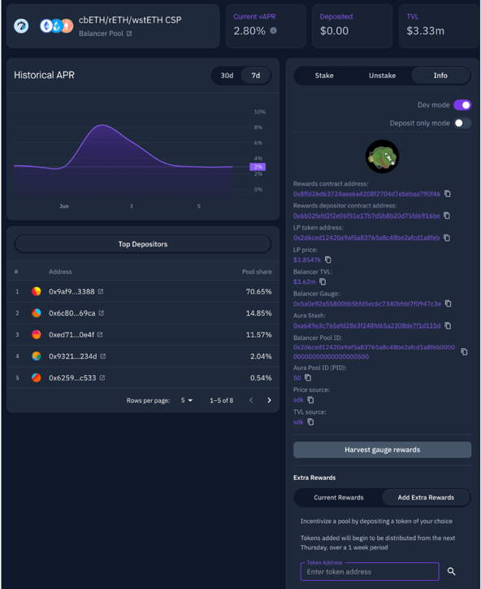
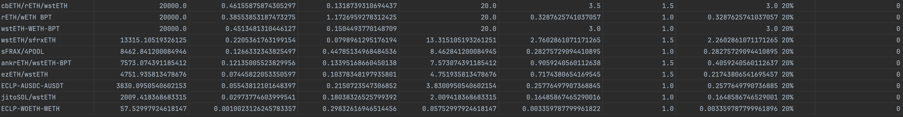

## Arbitrum Grants Distributor  - STIP-Bridge
Distribution program pays out 50,000 ARB per week for 12 weeks based on veBAL voting for whitelisted pools on Arbitrum.

Pools are capped at 20% of the total weekly $ARB by default.

$ARB to a pool is boosted by a dynamic boost (described below based on fees vs emissions), and a fixed boost that can be assigned by Balancer BD to support special initiatives.

The pools participating in the program, as well as configuration around overriding caps and fixed boost can be found [here](https://github.com/BalancerMaxis/arbitrum_grants_distributor/blob/main/automation/arbitrum_stip_bridge_start_q2_2024.py#L29).

Pools which are at least 50% interest bearing or deemed as strategic liquidity are eligible for whitelist addition.

Balancer’s STIP.B application can be found [here[(https://forum.arbitrum.foundation/t/final-balancer-stip-addendum/23288).

---

## Configuration and Data
- [ARB amounts emitted](https://github.com/BalancerMaxis/arbitrum_grants_distributor/blob/main/automation/constants.py#L12)
- [Pool Whitelist and Modifiers](https://github.com/BalancerMaxis/arbitrum_grants_distributor/blob/main/automation/arbitrum_stip_bridge_start_q2_2024.py)
- [Output Data](https://github.com/BalancerMaxis/arbitrum_grants_distributor/tree/main/output) is collected in output/ directory
- [BAL Emissions per Year](https://github.com/BalancerMaxis/arbitrum_grants_distributor/blob/main/automation/emissions_per_year.py)

---

## How boost is calculated

Boost is based on 2 factors.

1. A fixed boost granted to incentive important initiatives
2. A variable boost based on the efficiency of the pool (fees/emissions)

### Fixed boost
By default, all whitelisted pools have a fixed boost of 1.  Here are some examples of situations where fixed boost might be assigned and what it could be:

| Desired Outcome/Activity                               | Fixed Boost |
|--------------------------------------------------------|-------------|
| 100% Intrest Bearing                                   | 1.5x        |
| IB token Mintable on Arbitrum                          | 1.75x       |
| Short term boost for a shared/major marketing campaign | 2x          |

Note that these values are not meant to be cumulative.  The highest one to apply would be used. 

#### 100% Intrest Bearing    
- 100% of the liqudity in this pool is interest bearing
  - Get this by pairing your Intrest Bearing Token with other yield bearing tokens such as wstETH, sDAI, or sFRAX, etc. 
  - Does not apply to weighted pools.  Intended for CL based approaches such as Stableswaps and Gyro. 

#### IB Token Mintable on Arbitrum
- To encourage a more native yield environment on Arbitrum, we are open to considering and granting boost to projects that enable native minting/burning of their yield bearing asset on Arbi.  
  - In general, we would expect these pools to have at least 50% of the tokens in the pool mintable on Arbitrum.
  
#### Short term boost for a shared/major marketing campaign
- Sometimes the best way to grow a pool is fast, with lots of incentives and marketing push.
  - In cases where it's all coming together like that, and we have a partner looking to also hit it hard, we may consider a short term but high boost or some fixed incentives to help kick things off.

### Variable Fee Based Boost (1-3x)
The variable boost is determined by using the following formula:

`Variable Boost = min(Fees Earned / (USD Value of BAL emitted + 1), 3)`

The variable boosted is capped at 3 and has a minimum of 1.

The fee based boost is added to the fixed boost, so:

### Calculating the final boost
Total Boost = Fixed Boost + Variable Boost - 1

where both boosts will always be >=1.  The final boost will be automatically computed by the distribution process and applied.

## Fixed Incentives
While everything above describes the system whereby $ARB follows voting, the Council also has the ability to assign fixed incentives to pools. Fixed incentives involve allocating an exact amount of $ARB per week to a gauge, regardless of veBAL voting. 
they are included in cap calculations, but not considered when allocating the rest of the $ARB which follows voting.  Fixed incentives are cumulative on top of standard, vote following incentives.  

The budget for weekly fixed incentives is taken from the total available incentives per week.

This capability should be used sparingly, and primarily to direct incentives towards more quickly bootstrapping pools that have been added to the program but have not yet received votes due to process constraints around adding gauges to veBAL.

## Advice for DAOs that have their own $ARB from grants to distribute to Balancer pools

Balancer will be distributing $ARB via direct payments on the Balancer Gauge.  In order to keep accounting clear, and based on the way the gauge functions, it would be quite difficult to add other streams of STIP to this process.  As a result, we recommend the following 2 methods for distributing $ARB to Balancer pools during STIP.

- You can place a vote incentive on one of the Arbitrum Incentive markets: [HiddenHand](https://hiddenhand.finance/aura), [Paladin](https://quest.paladin.vote/#/create), [Vote Market](https://votemarket.stakedao.org/?market=bal).  
  - This will trigger voting, which will trigger BAL and AURA emissions as well as create more signaling for $ARB flows from this program.

- You can pay direct incentives into Aura, which will stream with no fees taken to depositors.
  - To do so go to your pool on Aura, go to info, go to dev-mode, scroll down and you’ll see a tab to schedule extra incentive flows to depositors. 
  - For example going to https://app.aura.finance/#/42161/pool/50 

_Pass ARB for the token, 0x912ce59144191c1204e64559fe8253a0e49e6548, follow the workflow to schedule how much for how long_ 

**Get in contact with Aura or Balancer BD or the Balancer Maxis (can find us on discord) if you need help figuring this out.**

## Example outputs

The CSV [here](output/arbitrum_stip_bridge_start_q2_2024_2024-05-17_2024-05-31.csv) shows the output of the model for the pools on Arbitrum using past data. The amounts distributed are for a 2 week epoch.  The outputs are based on the current core pools list, and the parameters defined above.  The whitelist, and parameters above are subject to change.

